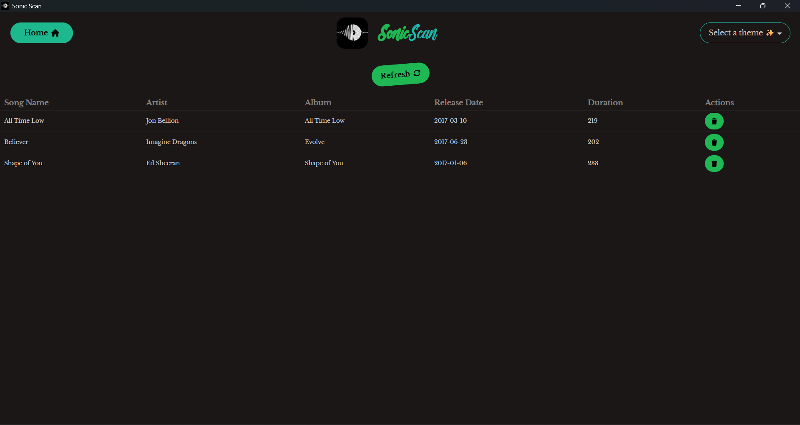

# SonicScan 🎼

A Music Fingerprinting and Identification App

## Features

- 🪙 ABSOLUTELY FREE
- 👆🏿 Song Fingerprinting
- 🔍 Song Search
- 📥 Song Download
- 🎸 Song Identification
- 🌐 Multi Device Support (Windows, Linux, Mac, Web, Android, iOS)
- 🎨 Multi Themed (powered by daisyui)

> Note: My implementation of fingerprinting is based on this old blogpost
> [How_does_Shazam_work_Coding_Geek](https://drive.google.com/file/d/1ahyCTXBAZiuni6RTzHzLoOwwfTRFaU-C/view)
> from 2015 so it maynot be very good at identifying songs.

> Note: Due to spotify not allowing to download songs, and Youtube downloader
> (yt-dlp) is not working in deployment server due to youtube's cache policy I
> have to use jiosaavn api to get the songs, So the song search may not be very
> accurate.

## Screenshots

### Home

<div style="
  display: flex;
  flex-direction: row;
  width: 100%;
">
  
  
</div>

### Songs List

<div style="
  display: flex;
  flex-direction: row;
  width: 100%;
">
  
  
</div>

### Add Songs

<div style="
  display: flex;
  flex-direction: row;
  width: 100%;">
  
  
</div>

### Search Songs

<div style="
  display: flex;
  flex-direction: row;
  width: 100%;">
  
  
</div>

## Tech Stack

- [Rust](https://www.rust-lang.org)
- [SolidJS](https://solidjs.com)
- [DaisyUI](https://daisyui.com)
- [Bun](https://bun.sh)
- [Tauri](https://tauri.app)
- [TailwindCSS](https://tailwindcss.com)
- [Valkey on Aiven](https://aiven.io/valkey)
- [Music Downloader](music-downloader/)
- [Music Finder](music-finder/)
- [Jiosaavn Api by Sumit Kolhe](https://github.com/sumitkolhe/jiosaavn-api)

## Development

> Note: Make sure to have `bun`, `cargo`, `node` installed on your system. For
> full prerequisites, check
> [tauri_prerequisites](https://v2.tauri.app/start/prerequisites/)

> Note: For android development, make sure to have `android studio` installed on
> your system and run android emulator before running `bunx tauri android dev`

> Note: For ios development, make sure to have `xcode` installed on your system
> and run ios simulator before running `bunx tauri ios dev`

### Environment Variables

```bash
REDIS_URI="<valkey_uri>"
MUSIC_FINDER_API_URL="<music_finder_api_url>"
JIOSAAVAN_API_URL="<jiosaavn_api_url>"
MUSIC_DOWNLOADER_API_URL="<music_downloader_api_url>"
```

### Development

```bash
bunx tauri dev                # Run desktop app
bunx tauri android dev        # Run android app
bunx tauri ios dev            # Run ios app
```

### Build

```bash
bunx tauri build             # Build desktop app
bunx tauri android build     # Build android app
bunx tauri ios build         # Build ios app
```

## How I Build This

- One Day while watching youtube I found a
  [video](https://www.youtube.com/watch?v=a0CVCcb0RJM) by
  [Chigozirim](https://www.youtube.com/@cgzirim) about how shazam works and I
  was amazed by It. He build a music fingerprinting app using golang and it was
  amazing. He build it based on the blogpost by
  [Coding_Geek](https://drive.google.com/file/d/1ahyCTXBAZiuni6RTzHzLoOwwfTRFaU-C/view).
  So inspired by it I decided to build a music fingerprinting app using rust.

- I started by exploring the audio processing part and then I discovered
  [Symphonia](https://github.com/sonic-rs/symphonia) which is a rust crate for
  audio processing. First I build a function to extract mono audio from a file
  using it and kept a frequency limited to 41.1 KHz as it is the maximum
  frequency that the human ear can hear. I also implemented functions to
  downsample the audio and normalise it. Then I visualized the spectrogram of
  the audio using [image](https://github.com/image-rs/image).

- Then I started to build the fingerprinting part and I used the STFT to extract
  the frequency domain representation of the audio and used a Hann window
  function and a hop size of 512 and FFT size of 2048. Then I calculated the
  STFT for each band using [realfft](https://github.com/Geal/realfft) crate.

- I implemented a function to filter the STFT based on the bands. To limit the
  number of bands based on which I compute the fingerprint so I used these bands
  `[
    (0, 32),
    (32, 64),
    (64, 128),
    (128, 256),
    (256, 512),
    (512, 1024),
    (1024, 2048),
    (2048, 4096),
    (4096, 8192),
    (8192, 20000),
]`
  based on the human ear's frequency response by this
  [blogpost](https://unison.audio/eq-frequency-chart/) and this
  [blogpost](https://www.gear4music.com/blog/audio-frequency-range/).

- For the bands I also tried to implement the Mel frequency scale as it is more
  accurate to human ear's frequency response but it didn't work out as expected
  and I haven't found any good implementation of it so I used the linear
  frequency scale with fixed band sizes.

- Using the filtered STFT I computed the fingerprint using nearest neighbors of
  5 peaks for each band and used the [kdtree](https://github.com/Geal/kdtree)
  crate and each of the fingerprint I computed the hash using the tuple values
  of the frequency and time and stored it in a valkey database.

- Then When I want to find the similar audio files I get the fingerprint of the
  audio file the functions and then search using the fingerprint as keys from
  the valkey database and then I sort the values based on the frequency, time
  difference and anchor count and then I return the top 3 respective songdata
  based on the filtered values with song_ids.

- Then I learned Tauri and used my favourite frontend framework
  [SolidJS](https://solidjs.com) with [TailwindCSS](https://tailwindcss.com) and
  [DaisyUI](https://daisyui.com) to build the UI with MotionOne to add
  animations and [Tauri](https://tauri.app) to build the desktop/web/android/ios
  app.

- Due to spotify not allowing to download songs, and Youtube downloader (yt-dlp)
  is not working in deployment server due to youtube's cache policy I have to
  use jiosaavn api to get the songs, So the song search may not be very
  accurate.

- Still the music downloader is working in dev mode as it can use local browser
  cookies to verify and download the songs.

- For the Jiosaavn api I used the
  [Jiosaavn Api by Sumit Kolhe](https://github.com/sumitkolhe/jiosaavn-api) and
  it is under MIT license so it is free for personal use.

- For the music finder I also discovered vercel rust runtimes and used it to
  deploy the music finder api functions for free.

- For the database I used [Valkey](https://aiven.io/valkey) on
  [Aiven](https://aiven.io) for free.

- Ultimately I enjoyed building this app and I hope you enjoy using it.

## License

GLWTS(Good Luck With That Shit) Public License

## Build with ♥️ by Rounak Sen
